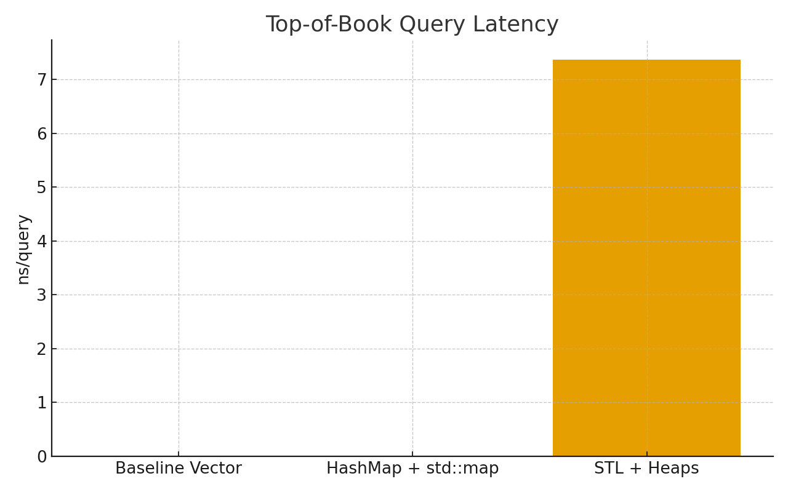

# High-Performance C++ Order Book — Final Report

**Project:** Building a High-Performance C++ Order Book  
## Performance Summary

| Implementation       | Insert (Mops/s) | Amend (Mops/s) | Delete (Mops/s) | Top-of-Book (ns) |
|----------------------|----------------:|---------------:|----------------:|-----------------:|
| Baseline Vector      | 16.816802 | 2.896468 | 5.811702 | <1 |
| HashMap + std::map   | 22.086936 | 4.358987 | 7.391502 | <1 |
| STL + Heaps          | 17.609725 | 6.237210 | 4.275699 | 7.367 |

**Charts**  
- 
- 

## Analysis Highlights
- **Best raw throughput:** HashMap + std::map.
- **Best ToB latency:** STL + Heaps (lazy eviction + O(1) peek).
- **Vector baseline:** Simpler but suffers from linear scans.

## Reproducibility
- Build: `cmake -S . -B build -DCMAKE_BUILD_TYPE=Release && cmake --build build -j`
- Run: `./build/benchmark_vector && ./build/benchmark_map && ./build/benchmark_heaps`
- Environment: macOS, Apple Clang/LLVM (version), C++20, `-O3 -march=native -DNDEBUG`.
